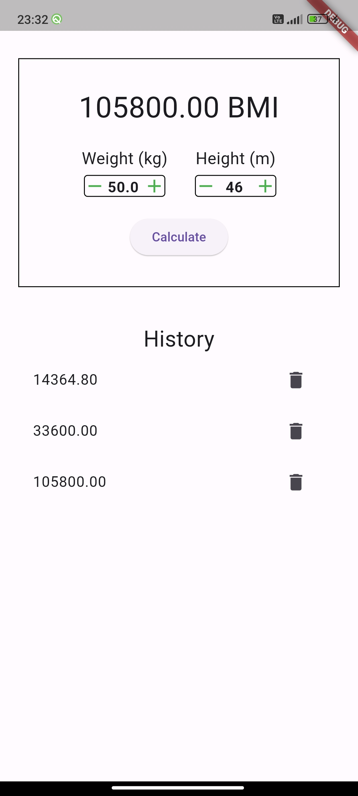
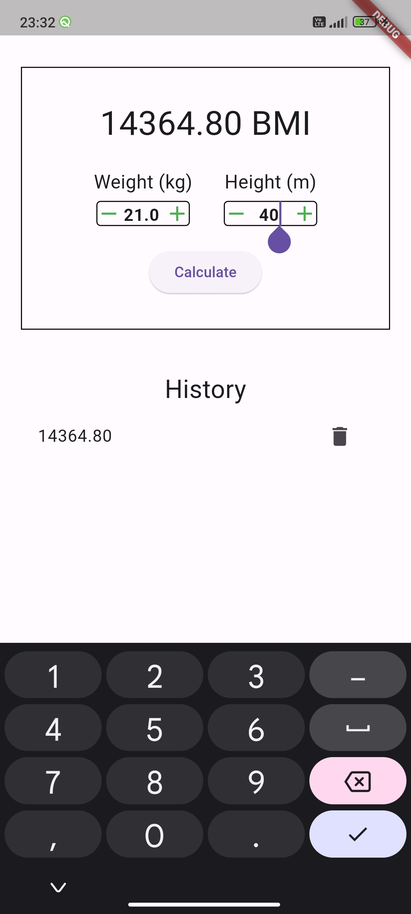

# BMI Calculator App

Welcome to the BMI Calculator App repository! This app is designed to calculate the Body Mass Index (BMI) of a human based on their height and weight. The app provides a user-friendly interface for inputting height and weight values, utilizing the 'Input_Quantity' dependency for enhanced user experience. Additionally, SharedPreferences are employed to retain previously set height and weight values entered by the user. Furthermore, the app displays a history of BMI calculations for reference.

## Features

- User-friendly interface for inputting height and weight.
- Utilizes 'Input_Quantity' dependency for smooth user interaction.
- SharedPreferences used to retain user's previous height and weight values.
- History feature displays past BMI calculations.

## Getting Started

To use this app, follow these simple steps:

1. **Clone the repository:**
   ```
   git clone https://github.com/your-username/bmi-calculator-app.git
   ```

2. **Open the project in Android Studio:**
   Open Android Studio and select "Open an existing project". Navigate to the directory where you cloned the repository and select the project.

3. **Build and run the project:**
   Once the project is loaded in Android Studio, build and run the project on an emulator or a physical device.

4. **Start calculating BMI:**
   Once the app is running, input your height and weight in the designated fields and press the "Calculate BMI" button to see your BMI. The app will display your BMI along with a history of previous calculations.

## Screenshots





## Dependencies

This project uses the following dependency:

- **Input_Quantity**: This library provides an easy-to-use interface for inputting numerical quantities with units, enhancing user experience when entering height and weight values.

## Contributions

Contributions to improve this BMI Calculator app are welcomed! If you'd like to contribute, please follow these steps:

1. Fork the repository.
2. Create a new branch for your feature or bug fix.
3. Make your changes and commit them.
4. Push your changes to your fork.
5. Submit a pull request with a description of your changes.

## Acknowledgments

- This app was created as a simple mini-project for educational purposes.
- Special thanks to the creators of the 'Input_Quantity' dependency for providing a useful tool for enhancing user input experience.